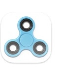

# System Spinner

System Spinner provides macOS system information in status bar. Minimal, small and light!

## Features

- Show CPU usage in system bar
- Top CPU/MEM process in popup window
- Memory statistics performance
- Network connection and ip adress
- CMS Information for Cpu Temp and Fan
- Audio and Brightness contoll DDC over HDMI/DVI/USB-C
- Full MacOS 26 Tahoe Liquid Glass support
- Spinner overlay effects
- Localization (English, Russian)

## Screenshots

  
## Tech

Written in Swift 5. Apple Silicon Only for MacOS 26 Tahoe, MacOS 15.6 Sequoia
- Based on [menubar_runcat](https://github.com/Kyome22/menubar_runcat)
- Based on [stats](https://github.com/exelban/stats)
- Based on [ActivityKit](https://github.com/Kyome22/ActivityKit)
- Based on [MonitorControl](https://github.com/MonitorControl/MonitorControl)

Used dependencies:
- [MediaKeyTap](https://github.com/the0neyouseek/MediaKeyTap)
- [SimplyCoreAudio](https://github.com/rnine/SimplyCoreAudio)
- [swift-atomics](https://github.com/apple/swift-atomics)
