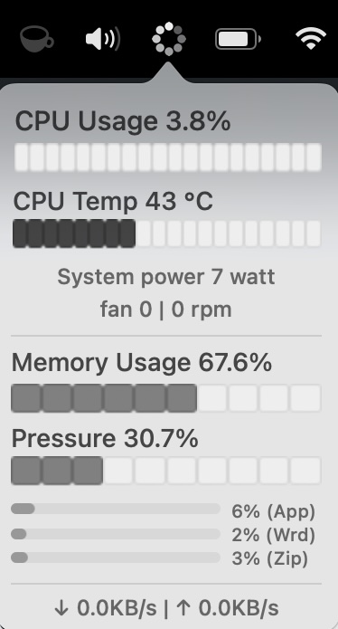
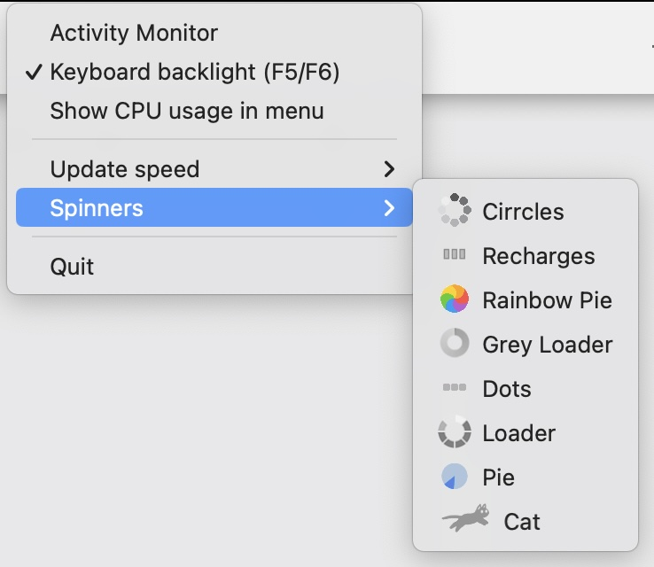

# System Spinner

System Spinner provides macOS system information in status bar. Minimal, small and light

## Features

- Show CPU usage
- Memory statistics performance
- Network connection
- CMS Information for Cpu Temp and Fan

## Tech

Written in Swift 5. Universal build.
- Based on [menubar_runcat](https://github.com/Kyome22/menubar_runcat)
- Based on [stats](https://github.com/exelban/stats)
- Based on [ActivityKit](https://github.com/Kyome22/ActivityKit)

You can download app from [releases](https://github.com/andrey-boomer/System-Spinner/releases)
