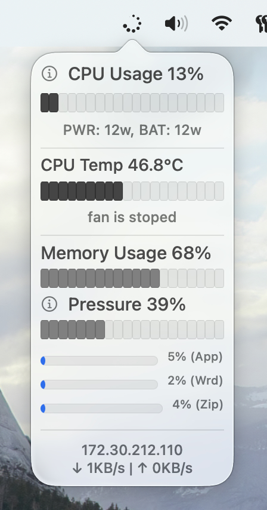

# System Spinner

System Spinner provides macOS system information in status bar. Minimal, small and light

## Features

- Show CPU usage
- Top CPU/MEM process in popup window
- Memory statistics performance
- Network connection
- CMS Information for Cpu Temp and Fan
- Audio and Brightness contoll DDC ove HDIM/DVI/USB-C [^1]
- Auto update

## Screenshots

  

  
## Tech

Written in Swift 5. Universal build.
- Based on [menubar_runcat](https://github.com/Kyome22/menubar_runcat)
- Based on [stats](https://github.com/exelban/stats)
- Based on [ActivityKit](https://github.com/Kyome22/ActivityKit)
- Based on [MonitorControl](https://github.com/MonitorControl/MonitorControl)

You can download app from [releases](https://github.com/andrey-boomer/System-Spinner/releases)

[^1]:!WARNING! This version can't detect monitor or audio output change, only when connect device on sleep! You need update it by hand, on click to status menu.
